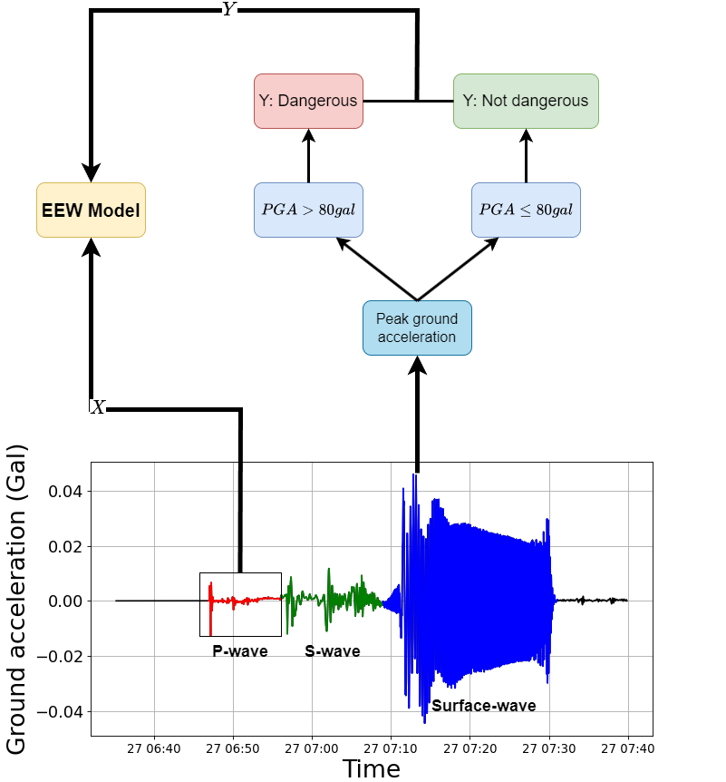
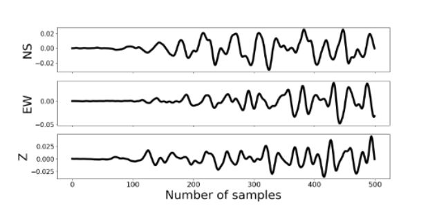
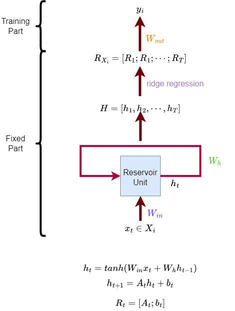
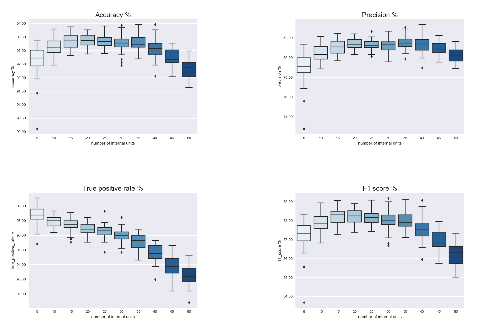

<h3 class='black'>Earthquake Early Warning System by Reservior Computing</h3> 

presented by: Phiphat Chomchit
 

---

- Phiphat Chomchit

Data science program
Faculty of engineering, Chiang Mai University

---
### Content outline.
* Earthquake
    - P-wave, S-wave
    - earthquake stations
* Earthquake Early Warning System
    - Working of EEW system
    - Deep neural network in EEW system
* Multi-chanel echo state network
---
<!-- _color: red -->
<!-- _backgroundColor: black -->
# <!-- fit  -->Earthquake
---
#### Earthquake

An **earthquake** is what happens when two blocks of the earth suddenly slip past one another. The surface where they slip is called the **fault** or **fault plane**. The location below the earth’s surface where the earthquake starts is called the **hypocenter**, and the location directly above it on the surface of the earth is called the **epicenter**.
<ref>Sources/Usage: Public Domain.</ref>

---
#### Earthquake Causes 

 this skin is not all in one piece – it is made up of many pieces like a puzzle covering the surface of the earth. Not only that, but these puzzle pieces keep slowly moving around, sliding past one another and bumping into each other. We call these puzzle pieces tectonic plates, and the edges of the plates are called the plate boundaries. The plate boundaries are made up of many faults, and most of the earthquakes around the world occur on these faults. Since the edges of the plates are rough, they get stuck while the rest of the plate keeps moving. Finally, when the plate has moved far enough, the edges unstick on one of the faults and there is an earthquake.

<ref>Sources/Usage: Public Domain.</ref>

---
### The size of earthquakes
The size of an earthquake depends on the size of the fault and the amount of slip on the fault, but that’s not something scientists can simply measure with a measuring tape since faults are many kilometers deep beneath the earth’s surface.
The insrument shakes with the earth below it, but the recording device remains stationary

---

### Earthquake waves

Seismograms come in handy for locating earthquakes too, and being able to see the P wave and the S wave is important. You learned how P & S waves each shake the ground in different ways as they travel through it. P waves are also faster than S waves, and this fact is what allows us to tell where an earthquake was.<p\>

---

## Can we predict earthquakes?

### The answer is **No**.

---
<!-- _color: red -->
<!-- _backgroundColor: black -->
# <!-- fit  -->Earthquake Early Warning System
---
### Earthquake Early Warning system
Various studies about earthquake early warning (EWW) propose a P-wave approach to predict the severity scale of ground motions or peak ground acceleration. The P-wave is tiny and the first wave that can be detected. On the other hand, the S-wave is a destructive wave causing damage. Therefore, this wave is used for the signal to predict a strong motion.

---
### peak ground acceleration

In EEW systems, a seismic station detects and monitors seismic waves. Figure \ref{fig1} shows that the EEW model approximates the damage from the ground motion by peak ground acceleration (PGA). Also, The peak ground acceleration (PGA) has a Gal unit (Unit to express the acceleration of earthquake) which $1Gal = 1cm/s^2$, and the PGA is the highest amplitude of the ground acceleration which is recorded by seismic stations

---

### Seismic Signal Data
If the PGA is more than $80 gal$ then the label shows the signal has dangerous motion (strong motion)

---
The features of the dataset are signals data that consists of three axes: EW, NS, and Z that are defined by:
$$
\begin{equation*}
X_i 
=
\begin{bmatrix}
NS_{1} & EW_{1} & Z_{1}\\
NS_{2} & EW_{2} & Z_{2}\\
\vdots & \vdots & \vdots\\
NS_{T} & EW_{T} & Z_{T}\\
\end{bmatrix};\quad
X = 
\begin{bmatrix}
X_{1}\\
X_{2}\\
\vdots\\
X_N
\end{bmatrix}
\end{equation*}
$$

And the labels of the dataset are PGA defined by:

$$
\begin{equation*}
    Y = 
\begin{bmatrix}
y_1\\
y_2\\
\vdots\\
y_N\\
\end{bmatrix}
\end{equation*}
$$
where $y_i$ is label of $X_i$. The labels of datasets are encoded by one hot encoder. If the PGA of the signal $X_i$ less than $80Gal$ then setting $y_i = [1, 0]$. Otherwise, $y_i = [0, 1]$.

---
### Echo State Networks

The Echo state network (ESN) is an RC that fixed recurrent weight units.
The ESN model contains two parts. The left figure shows how ESN trains and predicts data. The first part is the recurrent unit layer, which is fixed weight parameters and does not need a training process.They do not need to train the model but can represent the feature data for the supervised model.

---

Where $x_i = [NS_i\quad EW_i\quad Z_i]$

The space-representation of ESN model is the representation of latent space $(H)$ by predicting the next latent state $(h_{t+1})$ from recent latent state $(h_t)$ with auto-regressive models.
$$
\begin{align*}
    h_{t+1} &= A_th_t + b_t\\
    R_t &=  [A_t;b_t]
\end{align*}
$$

Readout vector of input data $X_i$ is defined by
 $$R_{X_i} = [R_1; R_2;\cdots; R_T]$$
and read out matrix is 
$$R = \begin{bmatrix}
    R_{X_1}\\R_{X_2}\\\vdots\\R_{X_N}
\end{bmatrix}$$

---

### Extreme learning machine
The Extreme Learning Machine is a single-layer feed-forward network (SLFN). The ELM not only runs faster than classical ANN but also can maintain high accuracy
[image source](https://www.mdpi.com/2073-8994/11/10/1284)

---

The ELM can be written by the matrix.
$$
\begin{equation*}
    H\beta = y
\end{equation*}
$$
where
$$
    H = 
\begin{bmatrix}
g(a_1,b_1,X_1) & \cdots & g(a_m,b_m,X_1)\\
\vdots & \ddots & \vdots\\
g(a_1,b_1,X_N) & \cdots & g(a_m,b_m,X_N)\\
\end{bmatrix}
$$
---
### The optimal output
The optimal output weight of $\beta$ is

$$\hat{\beta} = H^{\dagger}T$$

where $H^{\dagger} = (H^TH)^{-1}H^T$.

The Multi ES-ELM model uses the readout vector ($R$) to be learnable representations and replace readout vector to $H$ matrix. The ELM is also used to train the model.

$$W_{out} = R^\dagger Y$$
---
<!-- _color: red -->
<!-- _backgroundColor: black -->
# <!-- fit  -->Results
---
<!-- ### Metrices -->

---

